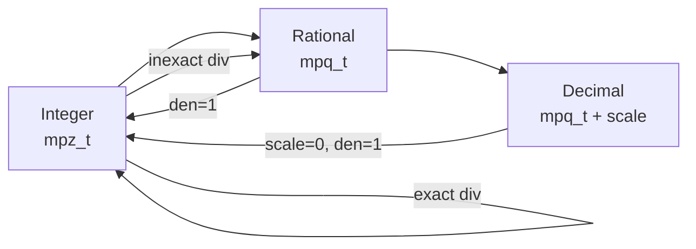
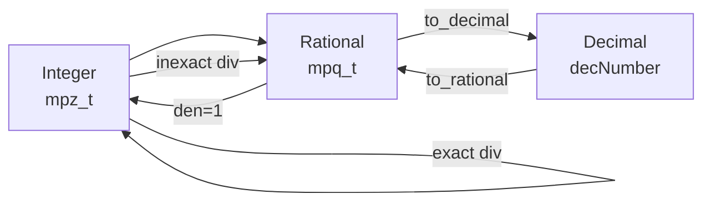

# Numeric Types: Design & Implementation Plan

OrgLang specifies three **arbitrary-precision** numeric types: **Integer**, **Rational**, and **Decimal**. This document evaluates implementation strategies, focusing on the C runtime that the Go compiler emits.

---

## 1. Language Requirements (from Reference)

| Type | Literal Syntax | Semantics | Examples |
| :--- | :--- | :--- | :--- |
| Integer | `[+-]?[0-9]+` | Signed, arbitrary precision | `42`, `-7` |
| Decimal | `[+-]?[0-9]+.[0-9]+` | Exact base-10, arbitrary precision. **Not** binary float. | `3.14`, `-0.001` |
| Rational | `INTEGER/INTEGER` (no spaces) | Exact fraction, arbitrary precision | `1/2`, `-3/4` |

### Division Rules

- **Exact**: `4 / 2` → Integer `2`
- **Inexact**: `3 / 2` → Rational `3/2`
- **Decimal operand**: result is Decimal (if terminating) or Rational (if non-terminating)

### Numeric Promotion

| Operation | Result Type |
| :--- | :--- |
| Integer × Integer | Integer |
| Integer × Rational | Rational |
| anything × Decimal | Decimal |

### Additional Requirements

- No scientific notation (reserved for future)
- Coercion: Strings/Tables → size, Booleans → 0/1
- Rationals auto-reduce (canonical form)
- Future: machine-type specialization when compiler can prove bounds

---

## 2. Integer — GMP `mpz_t`

**Decision: Use GMP `mpz_t`.** This is uncontroversial.

### API Surface Needed

| Operation | GMP Function |
| :--- | :--- |
| Init/Clear | `mpz_init`, `mpz_clear` |
| Set from string | `mpz_set_str(z, "123", 10)` |
| Set from long | `mpz_set_si` |
| Add/Sub/Mul | `mpz_add`, `mpz_sub`, `mpz_mul` |
| Div (exact check) | `mpz_divisible_p` → then `mpz_divexact` |
| Mod | `mpz_mod` |
| Power | `mpz_pow_ui` |
| Compare | `mpz_cmp` |
| Negate | `mpz_neg` |
| Bitwise | `mpz_and`, `mpz_ior`, `mpz_xor`, `mpz_com` |
| Shift | `mpz_mul_2exp`, `mpz_fdiv_q_2exp` |
| To string | `mpz_get_str` |
| Fits long? | `mpz_fits_slong_p` (for optimization) |

### Division Implementation

```c
OrgValue org_div_integer(mpz_t a, mpz_t b) {
    if (mpz_sgn(b) == 0) return org_error("division by zero");
    if (mpz_divisible_p(a, b)) {
        // Exact → Integer
        mpz_t result;
        mpz_init(result);
        mpz_divexact(result, a, b);
        return org_make_integer(result);
    } else {
        // Inexact → Rational
        mpq_t result;
        mpq_init(result);
        mpq_set_num(result, a);
        mpq_set_den(result, b);
        mpq_canonicalize(result);
        return org_make_rational(result);
    }
}
```

### Pros

- Industry standard, extremely optimized (assembly-level tuning)
- Handles numbers with millions of digits efficiently
- Perfect fit for OrgLang's Integer semantics

### Cons

- External dependency (must link `-lgmp`)
- Memory management must integrate with OrgLang's Arena model

---

## 3. Rational — GMP `mpq_t`

**Decision: Use GMP `mpq_t`.** Natural companion to `mpz_t`.

### API Surface Needed

| Operation | GMP Function |
| :--- | :--- |
| Init/Clear | `mpq_init`, `mpq_clear` |
| Set num/den | `mpq_set_num`, `mpq_set_den` |
| Canonicalize | `mpq_canonicalize` (auto-reduce) |
| Arithmetic | `mpq_add`, `mpq_sub`, `mpq_mul`, `mpq_div` |
| Compare | `mpq_cmp` |
| Negate | `mpq_neg` |
| Get num/den | `mpq_numref`, `mpq_denref` |
| To string | `mpq_get_str` |
| Is integer? | `mpz_cmp_ui(mpq_denref(q), 1) == 0` |

### Auto-Reduction

GMP's `mpq_canonicalize` automatically reduces fractions and normalizes signs:

- `6/4` → `3/2`
- `-1/-2` → `1/2`
- `0/5` → `0/1`

### Result Demotion

After every rational operation, check if the result is actually an integer:

```c
OrgValue org_maybe_demote_rational(mpq_t q) {
    if (mpz_cmp_ui(mpq_denref(q), 1) == 0) {
        // Denominator is 1 → return Integer
        mpz_t z;
        mpz_init_set(z, mpq_numref(q));
        mpq_clear(q);
        return org_make_integer(z);
    }
    return org_make_rational(q);
}
```

### Pros

- Same library as Integer (single dependency)
- Auto-reduction via `mpq_canonicalize`
- Exact arithmetic for all rational operations
- Division rules naturally implementable

### Cons

- Rational arithmetic is slower than integer (GCD computation)
- Display requires formatting `num/den` or converting to decimal string

---

## 4. Decimal — The Core Design Decision

This is the critical choice. The Reference specifies Decimal as distinct from binary floating-point — it must represent `0.1` **exactly**. Two approaches:

### Option A: Decimal as `mpq_t` with Power-of-10 Denominator

Represent `3.14` as `mpq_t(314, 100)`. The denominator is always `10^n` where `n` is the number of decimal digits.

#### Internal Representation

```c
typedef struct {
    mpq_t value;       // numerator / 10^scale
    long  scale;       // number of decimal digits (cached for display)
} OrgDecimal;
```

#### Parsing `3.14`

```c
OrgDecimal parse_decimal(const char* int_part, const char* frac_part) {
    OrgDecimal d;
    d.scale = strlen(frac_part);
    // numerator = int_part * 10^scale + frac_part
    mpz_t num, pow10;
    mpz_init_set_str(num, int_part, 10);
    mpz_init(pow10);
    mpz_ui_pow_ui(pow10, 10, d.scale);
    mpz_mul(num, num, pow10);           // int_part * 10^scale
    mpz_t frac;
    mpz_init_set_str(frac, frac_part, 10);
    mpz_add(num, num, frac);            // + frac_part
    // denominator = 10^scale
    mpq_init(d.value);
    mpq_set_num(d.value, num);
    mpq_set_den(d.value, pow10);
    // Do NOT canonicalize — preserve scale
    mpz_clear(num); mpz_clear(frac); mpz_clear(pow10);
    return d;
}
```

#### Arithmetic Rules

| Operation | Scale Rule | Example |
| :--- | :--- | :--- |
| `a + b` | `max(a.scale, b.scale)` | `1.5 + 0.25 = 1.75` (scale 2) |
| `a - b` | `max(a.scale, b.scale)` | `1.5 - 0.25 = 1.25` (scale 2) |
| `a * b` | `a.scale + b.scale` | `1.5 * 0.3 = 0.45` (scale 2) |
| `a / b` | Complex — see below | |

**Division policy**: `1.0 / 3.0` = `0.333...` — infinite decimal. **Decision: promote to Rational** (`1/3`), which preserves exact precision. This is consistent with the Integer division rule (`3 / 2` → `3/2`).

#### Pros

- **Exact** representation of all finite decimals
- Single library dependency (GMP only)
- Shares memory management with Integer/Rational
- Trivial conversion between Decimal and Rational (they're the same underlying type)
- Preserves trailing zeros (`1.50` stays `1.50` via scale)
- Arbitrary precision — no limit on digit count

#### Cons

- **Division is problematic**: `1.0 / 3.0` has no finite decimal representation
- Scale must be tracked manually (GMP `mpq_canonicalize` would destroy it)
- Multiplication causes scale explosion: `a.scale + b.scale` grows with each operation
- Must implement display logic to render as `3.14` instead of `314/100`
- No standard library support — all arithmetic wrappers are custom code
- No IEEE 754 compliance (no NaN, Infinity, rounding modes)

---

### Option B: decNumber Library

Use IBM's decNumber library, which implements the IEEE 754 decimal arithmetic standard.

#### Internal Representation

```c
#include "decNumber.h"

typedef struct {
    decNumber value;
    decContext ctx;  // or shared global context
} OrgDecimal;
```

#### Parsing `3.14`

```c
OrgDecimal parse_decimal(const char* literal) {
    OrgDecimal d;
    decContextDefault(&d.ctx, DEC_INIT_DECIMAL128);
    d.ctx.digits = 34;  // or higher for arbitrary precision
    decNumberFromString(&d.value, literal, &d.ctx);
    return d;
}
```

#### Feature Comparison

| Feature | decNumber | mpq+scale |
| :--- | :--- | :--- |
| Exact `0.1` | ✅ Yes | ✅ Yes |
| Exact `1/3` | ❌ Rounded | ❌ Problematic |
| Arbitrary precision | ✅ Up to ~1 billion digits | ✅ Unlimited |
| Division `1.0/3.0` | ✅ Rounded to context precision | ⚠️ Must decide what to do |
| Trailing zero preservation | ✅ Built-in | ✅ Via scale tracking |
| Rounding modes | ✅ 9 modes (IEEE 754) | ❌ Must implement |
| NaN, Infinity | ✅ Built-in | ❌ Must implement |
| Subnormals | ✅ Built-in | ❌ N/A |
| Format/display | ✅ `decNumberToString` | ❌ Custom formatting |
| Arithmetic operators | ✅ Full set built-in | ❌ All custom wrappers |
| Memory model | Own allocator | GMP allocator (Arena-compatible) |
| Dependency | decNumber (small, single-file-ish) | GMP (large, well-tested) |
| Maintenance | IBM, dormant but stable | GMP, actively maintained |
| Integration with Integer/Rational | Separate — needs conversion layer | Same library — trivial |

#### Pros

- Purpose-built for exact decimal arithmetic
- Handles division gracefully (rounds to context precision)
- Full IEEE 754 compliance (rounding modes, NaN, ∞)
- Small, self-contained C source (~25 files)
- `decNumberToString` handles display formatting
- Industry standard for financial/commercial computing
- No scale-explosion problem in multiplication

#### Cons

- **Two** library dependencies (GMP + decNumber) instead of one
- Separate memory model — harder to integrate with Arena
- Not truly "arbitrary" by default (fixed context precision, though adjustable)
- Dormant project — no recent updates (stable but no new features)
- Rounding may surprise users expecting exact results (`1.0 / 3.0` rounds silently)
- Conversion between decNumber and GMP `mpq_t`/`mpz_t` requires serialization

---

## 5. Comparison of Approaches

### Approach A: GMP-only (mpq+scale for Decimal)



**Philosophy**: One library, one memory model, unified type system. Decimal is just a "display hint" on a Rational.

### Approach B: GMP + decNumber



**Philosophy**: Best tool for each job. Decimal is a fundamentally different representation.

### Decision Matrix

| Criterion | Weight | A: mpq+scale | B: decNumber |
| :--- | :--- | :--- | :--- |
| Exact `0.1` representation | High | ✅ | ✅ |
| Division handling | High | ⚠️ Needs policy | ✅ Rounds |
| Single dependency | Medium | ✅ GMP only | ❌ GMP + decNumber |
| Arena integration | High | ✅ GMP allocators | ⚠️ Custom needed |
| Display formatting | Medium | ❌ Custom | ✅ Built-in |
| Type conversion simplicity | Medium | ✅ Trivial | ⚠️ Serialization |
| Code complexity | Medium | ⚠️ Custom wrappers | ✅ Library handles it |
| Maintenance/stability | Low | ✅ GMP active | ⚠️ decNumber dormant |
| IEEE 754 compliance | Low | ❌ | ✅ |

---

## 6. Decision: GMP-Only (Approach A)

**Approach A (GMP-only with mpq+scale)** is the chosen implementation:

1. **Single dependency** — simpler build, single allocator model, integrates cleanly with Arena memory management.

2. **Unified type system** — Integer, Rational, and Decimal share the same underlying GMP representation. Promotion and demotion are trivial pointer operations, not serialization.

3. **OrgLang's division semantics already handle the hard case** — when `Integer / Integer` is inexact, it produces a Rational, not a Decimal. So `1 / 3` = `1/3` (Rational), which is exact.

4. **Division policy for Decimal**: When a Decimal division produces a non-terminating result, **promote to Rational**. This preserves exactness and is consistent with the Integer division rule. Display shows `1/3` instead of `0.333...`.

### Division Across All Types (Summary)

| Division | Result | Example |
| :--- | :--- | :--- |
| Integer / Integer (exact) | Integer | `4 / 2` → `2` |
| Integer / Integer (inexact) | Rational | `3 / 2` → `3/2` |
| Decimal / Decimal (terminating) | Decimal | `1.0 / 0.5` → `2.0` |
| Decimal / Decimal (non-terminating) | Rational | `1.0 / 3.0` → `1/3` |
| Any / 0 | Error | `1 / 0` → Error |

---

## 7. Impact on Lexer and Parser

### Lexer Changes

| Area | Current | With GMP |
| :--- | :--- | :--- |
| INTEGER token value | Stored as Go `int64` or string | Stored as **string** (passed to `mpz_set_str` at codegen) |
| DECIMAL token value | Stored as Go `float64` or string | Stored as **two strings**: integer part + fractional part (to compute scale) |
| RATIONAL token value | Stored as two integers | Stored as **two strings**: numerator + denominator |
| Sign gluing | Attaches `+`/`-` to digit string | No change (sign becomes part of the string) |
| Overflow check | May validate range | **Removed** — no range limit |

**Key change**: The lexer must preserve the raw string representation of numbers, not convert them to native Go types. This is critical because:

- `mpz_set_str` needs the original digit string
- Decimal scale is determined by counting fractional digits (lost if converted to `float64`)
- No overflow is possible in arbitrary precision

### Parser Changes

Minimal. The parser already treats number tokens as atomic literals. The only change:

- AST nodes for `IntegerLiteral`, `DecimalLiteral`, `RationalLiteral` should store **string** values instead of Go numeric types
- The codegen (C emitter) converts string representations to GMP calls

### Codegen Changes (C Emitter)

The C emitter generates code that calls GMP functions at program initialization:

```c
// For literal: 123456789012345678901234567890
mpz_t __lit_0;
mpz_init_set_str(__lit_0, "123456789012345678901234567890", 10);

// For literal: 3.14
mpq_t __lit_1;
mpq_init(__lit_1);
// numerator = 314, denominator = 100
mpq_set_str(__lit_1, "314/100", 10);

// For literal: 1/2
mpq_t __lit_2;
mpq_init(__lit_2);
mpq_set_str(__lit_2, "1/2", 10);
mpq_canonicalize(__lit_2);
```

---

## 8. Runtime Value Representation

```c
typedef enum {
    ORG_INTEGER,
    ORG_RATIONAL,
    ORG_DECIMAL,
    ORG_BOOLEAN,
    ORG_STRING,
    ORG_TABLE,
    ORG_FUNCTION,
    ORG_ERROR,
    // ...
} OrgType;

typedef struct {
    OrgType type;
    union {
        mpz_t   integer;
        mpq_t   rational;
        struct {
            mpq_t value;
            long  scale;    // number of fractional digits
        } decimal;
        int     boolean;
        // ... other types
    };
} OrgValue;
```

### Memory Management Integration

GMP supports custom allocators via `mp_set_memory_functions`:

```c
void* org_gmp_alloc(size_t size) {
    return org_arena_alloc(current_arena, size);
}

void org_gmp_free(void* ptr, size_t size) {
    // No-op in arena model — freed by arena teardown
}

void* org_gmp_realloc(void* ptr, size_t old_size, size_t new_size) {
    void* new_ptr = org_arena_alloc(current_arena, new_size);
    memcpy(new_ptr, ptr, old_size);
    return new_ptr;
}

// At startup:
mp_set_memory_functions(org_gmp_alloc, org_gmp_realloc, org_gmp_free);
```

This ensures all GMP allocations go through OrgLang's Arena, enabling bulk deallocation.

---

## 9. Arithmetic Operation Matrix

For `+`, `-`, `*`:

| Left \ Right | Integer | Rational | Decimal |
| :--- | :--- | :--- | :--- |
| **Integer** | Integer | Rational | Decimal |
| **Rational** | Rational | Rational | Decimal |
| **Decimal** | Decimal | Decimal | Decimal |

For `/` (division may demote):

| Left \ Right | Integer | Rational | Decimal |
| :--- | :--- | :--- | :--- |
| **Integer** | Integer or Rational | Rational | Decimal or Rational |
| **Rational** | Rational | Rational | Decimal or Rational |
| **Decimal** | Decimal or Rational | Decimal or Rational | Decimal or Rational |

> [!NOTE]
> "Decimal or Rational" means: Decimal if the result has a terminating decimal representation, Rational otherwise. In practice, a Decimal division result is terminating if and only if the denominator (after reduction) has no prime factors other than 2 and 5.

### Implementation Pattern

```c
OrgValue org_add(OrgValue a, OrgValue b) {
    // Coerce non-numeric types
    a = org_coerce_to_number(a);
    b = org_coerce_to_number(b);

    // Decimal wins
    if (a.type == ORG_DECIMAL || b.type == ORG_DECIMAL) {
        OrgDecimal da = org_to_decimal(a);
        OrgDecimal db = org_to_decimal(b);
        return org_decimal_add(da, db);
    }

    // Rational + anything → Rational
    if (a.type == ORG_RATIONAL || b.type == ORG_RATIONAL) {
        mpq_t qa, qb, result;
        org_to_mpq(a, qa);
        org_to_mpq(b, qb);
        mpq_init(result);
        mpq_add(result, qa, qb);
        return org_maybe_demote_rational(result);
    }

    // Integer + Integer
    mpz_t result;
    mpz_init(result);
    mpz_add(result, a.integer, b.integer);
    return org_make_integer(result);
}
```

---

## 10. Build Integration

### GMP Dependency

```makefile
# In generated Makefile or build script
CFLAGS += $(shell pkg-config --cflags gmp 2>/dev/null)
LDFLAGS += $(shell pkg-config --libs gmp 2>/dev/null || echo "-lgmp")
```

The Go compiler should:

1. Check that GMP headers are available at build time
2. Emit `#include <gmp.h>` in the generated C code
3. Link with `-lgmp` when compiling the C output

### Installation Requirement

GMP is available in all major package managers:

- Ubuntu/Debian: `apt install libgmp-dev`
- macOS: `brew install gmp`
- Arch: `pacman -S gmp`
