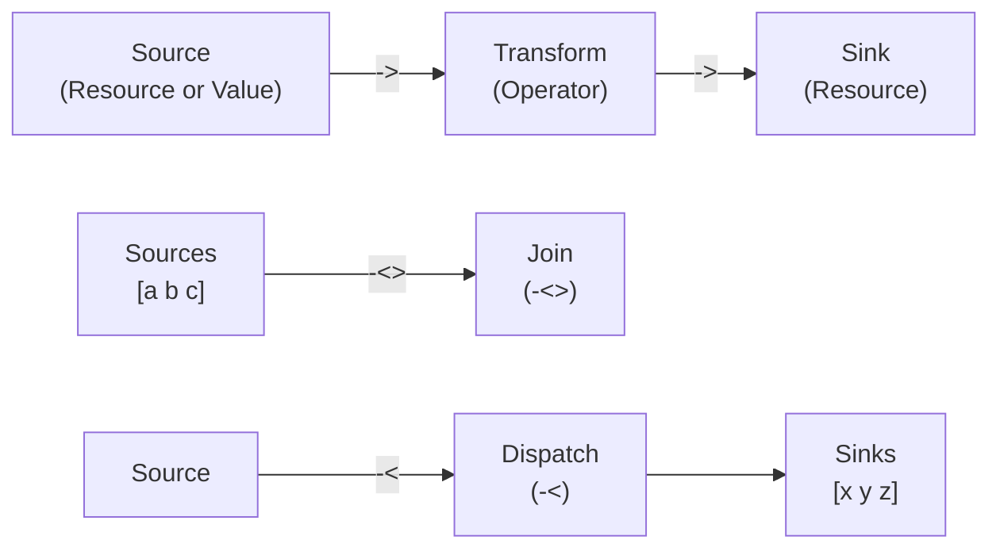

# Resources: Design & Semantics Plan

## 1. What Resources Are

Resources are OrgLang's mechanism for **effect reification** — they turn side effects into first-class, composable values. Every interaction with the outside world (file I/O, network, screen, timers) is represented as a **Resource**, not as direct function calls.

### Core Principle: Algebraic Effects

"Doing" a side effect is separated from "interpreting" it:

1. A **Resource Definition** (`@:`) is a blueprint — a Table with lifecycle hooks that describe *how* to handle the effect.
2. A **Resource Instance** (`@name`) is a live, stateful handle — created at runtime by executing the `create` hook.
3. The **Runtime** interprets the instance by calling its hooks at the appropriate moments.

This separation means:

- Resources are deterministic — their lifecycle is scoped and predictable.
- Resources are composable — they can be chained with flux operators.
- Resources are testable — you can substitute a mock resource with the same interface.

### Resources vs Functions

| Aspect | Function (Operator) | Resource |
| :--- | :--- | :--- |
| Defined with | `name : { body }` | `Name @: [hooks]` |
| Invoked with | `name(arg)` or `arg -> name` | `@Name` (instantiation) |
| State | Stateless (closure captures only) | Stateful (`create` returns initial state) |
| Side effects | Pure (no I/O) | Effectful (I/O via `@sys` or similar) |
| Lifecycle | Scope-based (Arena) | Explicit (`create`/`next`/`destroy`) |

## 2. How Resources Work

### 2.1 Definition (`@:`)

A resource is defined using the `@:` operator. The left side is a name, the right side is a Table with lifecycle hooks:

```rust
Logger @: [
    create:  { ... }    # Optional — called on instantiation
    next:    { ... }    # Required — called on each data push/pull
    destroy: { ... }    # Optional — called on teardown
];
```

#### Lifecycle Hooks

| Hook | Arity | When Called | Purpose |
| :--- | :--- | :--- | :--- |
| `create` | Unary or nullary | On `@Name` instantiation | Initialize state (open file, allocate buffer). Returns initial state. |
| `next` | Unary | On each `->` push or pull | Process one unit of data. `right` is the incoming data. |
| `destroy` | Nullary | On scope exit or flow completion | Cleanup (close file descriptor, flush buffer). |

> [!NOTE]
> Only `next` is strictly required. A resource with no `create` starts with no initial state. A resource with no `destroy` has no cleanup — it relies on the Arena for memory reclamation.

### 2.2 Instantiation (`@`)

The prefix `@` operator creates a live Resource Instance:

```rust
main: {
    "Hello, World!" -> @stdout
}
```

1. `@stdout` triggers `stdout.create()` (if defined), producing an instance with initial state.
2. The instance is now ready to receive or produce data via `next`.
3. When the enclosing scope exits, `stdout.destroy()` is called (if defined).

> [!IMPORTANT]
> `@` must be used inside an operator body `{ ... }`. This is because resource instantiation ties the instance's lifetime to the enclosing scope's Arena.

### 2.3 Data Direction: Push vs Pull

A resource's `next` hook serves both directions:

- **Sink** (data pushed into it): `"data" -> @stdout` — `next` receives `right = "data"`.
- **Source** (data pulled from it): `@stdin -> transform` — `next` is called repeatedly; each call returns one datum.

The direction is determined by the resource's position relative to `->`, not by the resource definition itself. The same resource can be used as both source and sink if its `next` hook handles both cases.

## 3. Interaction with Flux Operators

### 3.1 Push (`->`)

The simplest flow: data moves left-to-right.

```rust
source -> sink
```

**Semantics**:

1. Evaluate `source` — if it's a resource, call `next` to pull one datum.
2. Pass the datum to `sink` — if it's a resource, call `next` with the datum.
3. Repeat until `source` is exhausted (returns Error or empty).

**Chaining**: Flows compose left-to-right.

```rust
@stdin -> { right * 2 } -> @stdout
```

Each `->` creates a pipeline stage. The intermediate `{ right * 2 }` is a transform (an operator, not a resource), applied to each datum.

**Strings as sources**: Since strings are tables of codepoints, pushing a string to a resource sends each codepoint individually:

```rust
main: { "Hello" -> @Logger }
# Sends 5 separate pulses: "H", "e", "l", "l", "o"
```

To send the string as a single value, wrap it in a table:

```rust
main: { ["Hello"] -> @Logger }
# Sends 1 pulse: "Hello"
```

### 3.2 Dispatch (`-<`)

Balanced fan-out: distributes data across multiple sinks.

```rust
@tasks -< [worker1 worker2 worker3]
```

**Semantics**:

1. Pull a datum from the left source.
2. Send it to exactly **one** sink from the right-side table, chosen by round-robin or load-balancing.
3. Repeat until exhausted.

**Degeneration**: If the right side has only one sink, `-<` behaves identically to `->`.

### 3.3 Join (`-<>`)

Synchronized fan-in: merges multiple sources into coordinated packets.

```rust
[sensor1 sensor2] -<> processor
```

**Semantics**:

1. Wait for **every** source in the left-side table to produce at least one datum.
2. Combine the data into a single Table (one element per source).
3. Send the combined Table as one "pulse" to the right-side sink.
4. Repeat until any source is exhausted.

### 3.4 Operator Interaction Summary



## 4. Implementation Overview

### 4.1 Runtime Representation

A Resource Definition is a Table with well-known keys. A Resource Instance is a runtime struct:

```
OrgResourceDef:
    create:  *OrgValue   // pointer to create operator (nullable)
    next:    *OrgValue   // pointer to next operator (required)
    destroy: *OrgValue   // pointer to destroy operator (nullable)

OrgResourceInst:
    def:     *OrgResourceDef  // back-pointer to definition
    state:   *OrgValue        // mutable state returned by create()
    arena:   *OrgArena        // owning Arena for lifetime tracking
```

### 4.2 The `@sys` Primitive

`@sys` is the single low-level bridge to C system calls. It is **not** a resource — it is a runtime primitive that takes a command list:

```rust
["write" 1 "Hello" -1] @ sys   # write(fd=1, buf="Hello", len=-1 means auto)
["read" 0 1024] @ sys          # read(fd=0, buf, len=1024)
```

All standard library resources (`@stdout`, `@stdin`, `@stderr`) are implemented using `@sys`:

```rust
stdout @: [
    next: { ["write" 1 right -1] @ sys }
];
```

> [!NOTE]
> `@sys` is a temporary design. Future versions may replace it with specialized primitives (`@file`, `@net`, `@timer`) for better type safety and performance.

### 4.3 Scoped Lifetime and Arena Integration

Resource instances are tied to the Arena of their enclosing scope:

1. **Instantiation**: `@Name` allocates the instance in the current Arena and registers `destroy` in the Arena's **Teardown Registry**.
2. **Usage**: `next` calls happen within the flow's execution context.
3. **Teardown**: When the Arena is freed (scope exit, flow completion), the Teardown Registry is walked in **reverse creation order**, calling `destroy` on each registered resource.

This provides RAII-like deterministic cleanup without garbage collection.

### 4.4 Scheduler Integration

The Hybrid Scheduler treats each `->` pulse as a schedulable task:

- **Seed Pulse**: `@args` is the initial "spark" — it produces the first datum that starts the flow.
- **Frame Reset**: For long-running streams (`@stdin -> @stdout`), the scheduler can reset Arena pointers between pulses when data is fully consumed, enabling infinite execution in finite memory.
- **Parallel Flows**: Multiple flows (e.g., `["Hello" -> @stdout, "World" -> @stderr]`) are scheduled as independent fibers.

### 4.5 Parser Impact

- `@:` is a single LED token at BP 80 (right-associative), same as `:`. The parser produces a `ResourceDef` AST node.
- `@` (prefix) at BP 900 produces a `ResourceInst` AST node.
- `@` (infix) at BP 900 produces an `InfixExpr` for module loading (`"lib" @ org`).
- `->`, `-<`, `-<>` are standard LED operators at BP 50 that take full expressions on both sides.

### 4.6 Open Questions (Deferred)

These questions will be addressed after the parser is implemented:

- [ ] **Resource state mutation**: How does `next` update state between calls? Does `create` return a mutable cell, or is state threaded through return values?
- [ ] **Error propagation in flows**: When `next` returns an Error, does it terminate the entire flow or just skip the datum?
- [ ] **Bidirectional resources**: Can a single resource be both source and sink in the same flow? How does `next` distinguish direction?
- [ ] **Resource composition**: Can resources be composed with `o`? E.g., `Logger o Formatter` — compose two resource definitions?
- [ ] **`@sys` replacement**: What specialized primitives will replace `@sys`? What is the minimal set?
- [ ] **Backpressure**: How does `-<` handle a slow sink? Does the source block, buffer, or drop?
