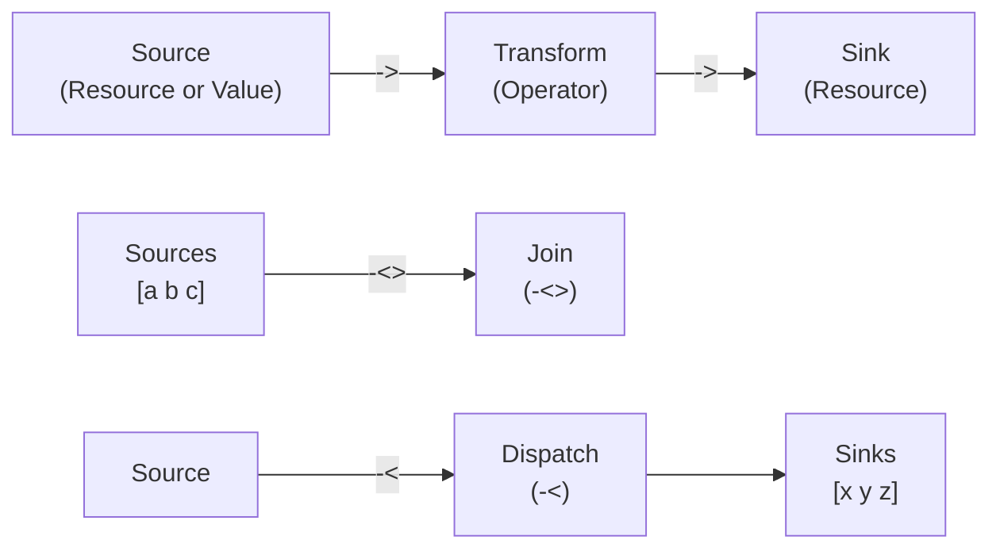

# Resources: Design & Semantics Plan

## 1. What Resources Are

Resources are OrgLang's mechanism for **effect reification** — they turn side effects into first-class, composable values. Every interaction with the outside world (file I/O, network, screen, timers) is represented as a **Resource**, not as direct function calls.

### Core Principle: Algebraic Effects

"Doing" a side effect is separated from "interpreting" it:

1. A **Resource Definition** (`@:`) is a blueprint — a Table with lifecycle hooks that describe *how* to handle the effect.
2. A **Resource Instance** (`@name`) is a live, stateful handle — created at runtime by executing the `create` hook.
3. The **Runtime** interprets the instance by calling its hooks at the appropriate moments.

This separation means:

- Resources are deterministic — their lifecycle is scoped and predictable.
- Resources are composable — they can be **chained** with flux operators (not composed with `o`).
- Resources are testable — you can substitute a mock resource with the same interface.

### Design Philosophy: Simplicity Through Composition

The entire idea of flux and resources is to present a model of **effect management without complexity**. Rather than building blocking, buffering, and backpressure into the core resource model, these concerns are themselves modeled as resources that are added to the flux chain. This keeps the core model minimal and orthogonal.

### Resources vs Functions

| Aspect | Function (Operator) | Resource |
| :--- | :--- | :--- |
| Defined with | `name : { body }` | `Name @: [hooks]` |
| Invoked with | `name(arg)` or `arg -> name` | `@Name` (instantiation) |
| State | Stateless (closure captures only) | Stateful (`create` returns initial state) |
| Side effects | Pure (no I/O) | Effectful (I/O via primitive resources) |
| Lifecycle | Scope-based (Arena) | Explicit (`create`/`next`/`destroy`) |
| Composition | `o` operator, `|>` partial app | Flux operators only (`->`, `-<`, `-<>`) |

> [!IMPORTANT]
> Resources **cannot** be composed with `o`. The `@:` operator defines a resource; the flux operators (`->`, `-<`, `-<>`) are the only way to chain resources into pipelines. There may be use cases justifying an inheritance model (where only specific hooks of one resource definition are overridden), but this is **TBD**.

## 2. How Resources Work

### 2.1 Definition (`@:`)

A resource is defined using the `@:` operator. The left side is a name, the right side is a Table with lifecycle hooks:

```rust
Logger @: [
    create:  { ... }    # Optional — called on instantiation
    next:    { ... }    # Required — called on each data interaction
    destroy: { ... }    # Optional — called on teardown
];
```

#### Lifecycle Hooks

| Hook | Arity | When Called | Purpose |
| :--- | :--- | :--- | :--- |
| `create` | Unary or nullary | **Before** the operator body executes | Initialize state (open file, allocate buffer). Returns initial state. |
| `next` | Unary | On each data interaction in the flow | Process one unit of data. `right` is the incoming data. |
| `destroy` | Nullary | **After** the operator body finishes | Cleanup (close file descriptor, flush buffer). |

> [!NOTE]
> Only `next` is strictly required. A resource with no `create` starts with no initial state. A resource with no `destroy` has no cleanup — it relies on the Arena for memory reclamation.

### 2.2 Instantiation (`@`) and Lifecycle Scoping

The prefix `@` operator creates a live Resource Instance:

```rust
main: {
    "Hello, World!" -> @stdout
}
```

**Lifecycle scoping**: The `@` operator must be used inside an operator body `{ ... }`. This is because **all `create` hooks of all instantiated resources are called before the operator body executes**, and **all `destroy` hooks are called after the body finishes**:

```rust
myOp: {
    # Before body: stdout.create() is called (if defined)
    # Before body: Logger.create() is called (if defined)

    "Hello" -> @stdout;
    "World" -> @Logger;

    # After body: Logger.destroy() is called (reverse order)
    # After body: stdout.destroy() is called
}
```

This is why `@` cannot appear at the top level — there is no enclosing operator to define the lifecycle boundary.

### 2.3 Data Model: Pull-Based with Ready Signals

OrgLang's resource model is fundamentally **pull-based**. Only pulled data exists:

1. **Sinks signal readiness**: A sink sends a signal that it is available to receive data (potentially via a `ready` hook — TBD).
2. **Sources respond**: When a sink is ready, the source produces and sends the next datum.
3. **No unsolicited push**: Data is never produced unless a downstream consumer has signaled it can accept it.

This pull-based model ensures:

- No unbounded buffering — data only exists when a consumer is ready.
- Natural backpressure — a slow sink automatically throttles the source.
- Deterministic memory usage — the Arena can be sized for one "pulse" of data at a time.

> [!NOTE]
> The exact mechanism for readiness signaling (e.g., a `ready` hook on the resource definition) is **TBD**. The current implementation uses a simpler model where `next` is called in a loop, but the design intent is pull-based.

### 2.4 Non-Resource Sources

If the source is not a resource (e.g., a Table or a literal value), the workflow is the same, albeit simpler:

```rust
# Table as source — each element is a datum
[1 2 3] -> { right * 2 } -> @stdout

# String as source — each codepoint is a datum
"Hello" -> @Logger
```

A non-resource source does not have `create`/`destroy` hooks or state — it simply yields its elements one at a time into the flow.

### 2.5 Source vs Sink vs Transformer

The distinction between sources, sinks, and whether a resource can be a **transformer** (both source and sink) is **TBD**. Currently:

- **Source**: appears on the left of `->` — produces data via `next`.
- **Sink**: appears on the right of `->` — consumes data via `next`.
- **Transformer**: a resource that appears in the middle of a chain, consuming from one side and producing to the other. Whether this requires a dedicated hook or is handled by `next` alone is an open question.

## 3. Interaction with Flux Operators

### 3.1 Push (`->`)

The simplest flow: data moves left-to-right.

```rust
source -> sink
```

**Semantics**:

1. The sink signals readiness.
2. The source responds by producing one datum (via `next` if resource, or yielding next element if Table/String).
3. The datum is passed to the sink's `next`.
4. Repeat until the source is exhausted (returns Error or empty).

**Chaining**: Flows compose left-to-right.

```rust
@stdin -> { right * 2 } -> @stdout
```

Each `->` creates a pipeline stage. The intermediate `{ right * 2 }` is a transform (an operator, not a resource), applied to each datum.

**Strings as sources**: Since strings are tables of codepoints, pushing a string to a resource sends each codepoint individually:

```rust
main: { "Hello" -> @Logger }
# Sends 5 separate pulses: "H", "e", "l", "l", "o"
```

To send the string as a single value, wrap it in a table:

```rust
main: { ["Hello"] -> @Logger }
# Sends 1 pulse: "Hello"
```

### 3.2 Dispatch (`-<`)

Balanced fan-out: distributes data across multiple sinks.

```rust
@tasks -< [worker1 worker2 worker3]
```

**Semantics**:

1. Pull a datum from the left source.
2. Send it to exactly **one** sink from the right-side table, chosen by round-robin or load-balancing.
3. Repeat until exhausted.

**Degeneration**: If the right side has only one sink, `-<` behaves identically to `->`.

### 3.3 Join (`-<>`)

Synchronized fan-in: merges multiple sources into coordinated packets.

```rust
[sensor1 sensor2] -<> processor
```

**Semantics**:

1. Wait for **every** source in the left-side table to produce at least one datum.
2. Combine the data into a single Table (one element per source).
3. Send the combined Table as one "pulse" to the right-side sink.
4. Repeat until any source is exhausted.

### 3.4 Effect Management Through Flux

Blocking, buffering, backpressure, and other flow-control concerns are **not** built into the core resource model. Instead, they are modeled as resources added to the flux chain:

```rust
# Buffering: a Buffer resource sits between source and sink
@stdin -> @buffer(1024) -> @processor -> @stdout

# Rate limiting: a Throttle resource controls throughput
@events -> @throttle(100) -> @handler
```

This keeps the core model minimal — `->`, `-<`, and `-<>` are the only primitives. Everything else is a resource.

### 3.5 Flow Diagram



## 4. Implementation Overview

### 4.1 Runtime Representation

A Resource Definition is a Table with well-known keys. A Resource Instance is a runtime struct:

```
OrgResourceDef:
    create:  *OrgValue   // pointer to create operator (nullable)
    next:    *OrgValue   // pointer to next operator (required)
    destroy: *OrgValue   // pointer to destroy operator (nullable)

OrgResourceInst:
    def:     *OrgResourceDef  // back-pointer to definition
    state:   *OrgValue        // mutable state returned by create()
    arena:   *OrgArena        // owning Arena for lifetime tracking
```

### 4.2 The `@sys` Primitive Resource

`@sys` is a **primitive resource** — the foundational resource upon which all other resources are built. It is the sole bridge between OrgLang and the operating system:

```rust
["write" 1 "Hello" -1] @ sys   # write(fd=1, buf="Hello", len=-1 means auto)
["read" 0 1024] @ sys          # read(fd=0, buf, len=1024)
```

All standard library resources (`@stdout`, `@stdin`, `@stderr`) are implemented using `@sys`:

```rust
stdout @: [
    next: { ["write" 1 right -1] @ sys }
];
```

> [!NOTE]
> The design intent is that **all** OS interaction (file access, sockets, random number generation, etc.) is done through resources, and ultimately through a small set of **primitive resources**. Whether `@sys` remains the single primitive or is split into specialized primitives (`@file`, `@net`, `@timer`) is **TBD**.

### 4.3 Arena as a Resource

The Arena memory model is itself a resource:

- **Default Arena**: A default Arena is always created for every operator invocation. It is instantiated before the body executes and destroyed after.
- **Custom Arenas**: User-defined arenas (like `@arena`) follow the same lifecycle — `create` before the body, `destroy` after. Resources instantiated "downstream" of an arena are tracked by it.
- **Customization**: The mechanism for user customization of the default Arena (e.g., setting initial page size, growth strategy) is **TBD**.

```rust
# Arena middleware — manages memory for downstream resources
"data.txt" -> @file_reader -> @arena -> @process -> @stdout
```

When the flow completes, `@arena` tears down all tracked resources in reverse creation order, then releases its pages.

### 4.4 Scheduler Integration

The Hybrid Scheduler treats each `->` pulse as a schedulable task:

- **Seed Pulse**: `@args` is the initial "spark" — it produces the first datum that starts the flow.
- **Frame Reset**: For long-running streams (`@stdin -> @stdout`), the scheduler can reset Arena pointers between pulses when data is fully consumed, enabling infinite execution in finite memory.
- **Parallel Flows**: Multiple flows (e.g., `["Hello" -> @stdout, "World" -> @stderr]`) are scheduled as independent fibers.

### 4.5 Parser Impact

- `@:` is a single LED token at BP 80 (right-associative), same as `:`. The parser produces a `ResourceDef` AST node.
- `@` (prefix) at BP 900 produces a `ResourceInst` AST node.
- `@` (infix) at BP 900 produces an `InfixExpr` for module loading (`"lib" @ org`).
- `->`, `-<`, `-<>` are standard LED operators at BP 50 that take full expressions on both sides.

### 4.6 Open Questions (Deferred)

These questions will be addressed after the parser is implemented:

- [ ] **Resource state mutation**: How does `next` update state between calls? Does `create` return a mutable cell, or is state threaded through return values?
- [ ] **Error propagation in flows**: When `next` returns an Error, does it terminate the entire flow or just skip the datum?
- [ ] **Sink/Source/Transformer identification**: How does the runtime distinguish direction? Is a `ready` hook needed? Can one resource be both source and sink?
- [ ] **Resource inheritance**: Should there be a way to override only specific hooks of an existing resource definition?
- [ ] **Primitive resource set**: What is the minimal set of primitive resources needed? Is `@sys` alone sufficient, or should it be split?
- [ ] **Arena customization**: How can users configure the default Arena (page size, growth strategy)?
- [ ] **Readiness signaling**: Exact mechanism for the pull-based `ready` signal.
