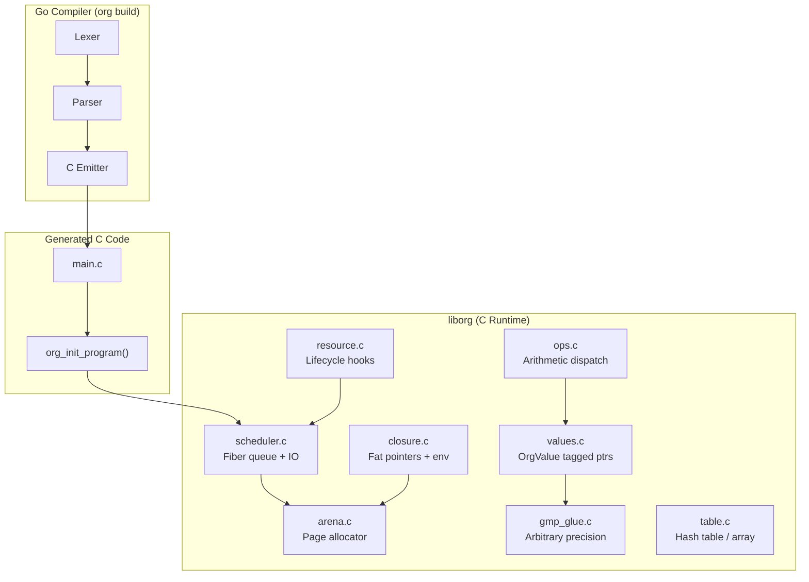

# Runtime Implementation Plan

This document synthesizes all design decisions from `design_gaps.md`, `design_hybrid_scheduler.md`, `number_support.md`, and `resource_plan.md` into a single actionable implementation plan for the OrgLang C runtime.

---

## Architecture Overview

The runtime (`liborg`) is the target library that generated C code links against. It provides memory management, value representation, numeric operations, closures, resources, and scheduling.



---

## Phase 1: Core Value System

**Goal**: Represent all OrgLang values in C, allocate them from an Arena, and perform basic operations.

### 1.1 Arena Allocator (`arena.c`, `arena.h`)

A chained-page bump-pointer allocator. No individual frees; memory is reclaimed in bulk.

```c
typedef struct ArenaPage {
    struct ArenaPage *prev;     // Linked list of pages
    size_t capacity;            // Total bytes in this page
    size_t used;                // Bytes allocated so far
    uint8_t data[];             // Flexible array member
} ArenaPage;

typedef struct Arena {
    ArenaPage *current;         // Active page
    size_t default_page_size;   // 4KB for small, 2MB for large
} Arena;
```

**API**:

| Function | Purpose |
|:---------|:--------|
| `arena_new(page_size)` | Create a new Arena |
| `arena_alloc(arena, size, align)` | Bump-allocate; overflow → new page |
| `arena_save(arena)` → `ArenaCheckpoint` | Save current position (for sub-scopes) |
| `arena_restore(arena, checkpoint)` | Reset to checkpoint (bulk free) |
| `arena_destroy(arena)` | Release all pages back to OS |

**Alignment**: All allocations are 8-byte aligned (required for tagged pointers).

**Large objects**: Requests > `page_size / 2` get their own dedicated page.

### 1.2 Tagged Values (`values.h`)

`OrgValue` is a `uint64_t`. The lower 2 bits encode the type:

```text
 63                              2  1  0
┌────────────────────────────────┬──┬──┐
│           payload              │ tag │
└────────────────────────────────┴──┴──┘

tag = 00  →  Pointer to heap object (Arena-allocated)
tag = 01  →  Small Integer (62-bit signed, shifted left by 2)
tag = 10  →  Special: Boolean (True/False), Error sentinel
tag = 11  →  Reserved (future: small float, symbol, etc.)
```

**Macros**:

```c
typedef uint64_t OrgValue;

// Tag checks
#define ORG_IS_PTR(v)    (((v) & 3) == 0)
#define ORG_IS_SMALL(v)  (((v) & 3) == 1)
#define ORG_IS_SPECIAL(v)(((v) & 3) == 2)

// Small Integer (62-bit signed)
#define ORG_TAG_SMALL(n) (((uint64_t)(int64_t)(n) << 2) | 1)
#define ORG_UNTAG_SMALL(v) ((int64_t)(v) >> 2)  // arithmetic shift

// Specials
#define ORG_TRUE   ((OrgValue)0x06)  // ...0110
#define ORG_FALSE  ((OrgValue)0x02)  // ...0010
#define ORG_ERROR  ((OrgValue)0x0A)  // ...1010
#define ORG_UNUSED ((OrgValue)0x0E)  // ...1110 (internal: absent operand)

// Heap object header (first 8 bytes of any Arena-allocated object)
typedef struct OrgObject {
    uint8_t type;    // ORG_TYPE_BIGINT, ORG_TYPE_RATIONAL, etc.
    uint8_t flags;
    uint16_t _pad;
    uint32_t size;   // Object size in bytes (for debugging/GC)
} OrgObject;

enum OrgType {
    ORG_TYPE_BIGINT,
    ORG_TYPE_RATIONAL,
    ORG_TYPE_DECIMAL,
    ORG_TYPE_STRING,
    ORG_TYPE_TABLE,
    ORG_TYPE_CLOSURE,
    ORG_TYPE_RESOURCE,
    ORG_TYPE_ERROR_OBJ,
};
```

### 1.3 GMP Integration (`gmp_glue.c`)

Redirects all GMP allocations through the Arena.

```c
static __thread Arena *current_fiber_arena;

void *org_gmp_alloc(size_t size) {
    return arena_alloc(current_fiber_arena, size, 8);
}

void org_gmp_free(void *ptr, size_t size) {
    (void)ptr; (void)size;  // No-op: Arena reclaims in bulk
}

void *org_gmp_realloc(void *ptr, size_t old_size, size_t new_size) {
    // Optimize: if ptr is the last allocation, extend in-place
    ArenaPage *page = current_fiber_arena->current;
    uint8_t *end = page->data + page->used;
    if ((uint8_t *)ptr + old_size == end &&
        page->used - old_size + new_size <= page->capacity) {
        page->used += (new_size - old_size);
        return ptr;
    }
    // Otherwise: allocate new, copy, abandon old
    void *new_ptr = arena_alloc(current_fiber_arena, new_size, 8);
    memcpy(new_ptr, ptr, old_size);
    return new_ptr;
}

void org_gmp_init(void) {
    mp_set_memory_functions(org_gmp_alloc, org_gmp_realloc, org_gmp_free);
}
```

**TLS update rule**: The scheduler sets `current_fiber_arena` every time it resumes a Fiber.

---

## Phase 2: Numeric Operations (`ops.c`)

Implements the arithmetic dispatch layer described in `number_support.md`.

### 2.1 Fast Path: Small Integers

```c
OrgValue org_add(OrgValue a, OrgValue b) {
    // Fast path: both small integers
    if (ORG_IS_SMALL(a) && ORG_IS_SMALL(b)) {
        int64_t sa = ORG_UNTAG_SMALL(a);
        int64_t sb = ORG_UNTAG_SMALL(b);
        int64_t result;
        if (!__builtin_add_overflow(sa, sb, &result)) {
            return ORG_TAG_SMALL(result);
        }
        // Overflow: promote to BigInt
        return org_add_bigint_from_smalls(sa, sb);
    }
    return org_add_slow(a, b);
}
```

### 2.2 Slow Path: GMP Dispatch

Follows the promotion matrix from `number_support.md` §9:

| Left \ Right | Integer  | Rational | Decimal |
|:-------------|:---------|:---------|:--------|
| **Integer**  | Integer  | Rational | Decimal |
| **Rational** | Rational | Rational | Decimal |
| **Decimal**  | Decimal  | Decimal  | Decimal |

Division may demote: exact Integer division stays Integer, inexact promotes to Rational.

### 2.3 Coercion Rules

| Source | Numeric Value |
|:-------|:-------------|
| Boolean `true` | `1` |
| Boolean `false` | `0` |
| String | Length (codepoint count) |
| Table | Size (element count) |
| Error | Propagates Error |

---

## Phase 3: Tables (`table.c`)

Tables are OrgLang's universal data structure — arrays, maps, and scopes.

### 3.1 Representation

```c
typedef struct OrgTable {
    OrgObject header;
    uint32_t count;          // Number of entries
    uint32_t capacity;       // Hash table capacity (power of 2)
    uint32_t next_index;     // Next auto-index for positional elements
    OrgTableEntry *entries;  // Hash table array (Arena-allocated)
} OrgTable;

typedef struct OrgTableEntry {
    OrgValue key;            // String or Integer key
    OrgValue value;          // The value (possibly a thunk)
    uint32_t hash;           // Cached hash
    uint32_t next;           // Collision chain index (open addressing or chaining)
} OrgTableEntry;
```

**Dual access**: Tables support both integer-indexed (array-like) and string-keyed (map-like) access. The `next_index` counter assigns `0, 1, 2, ...` to positional elements.

### 3.2 Lazy Evaluation

Table values are stored as **thunks** (unevaluated closures). Access operators force evaluation:

| Operator | Behavior |
|:---------|:---------|
| `.` (Dot) | Retrieve value, force thunk if present |
| `?` (Select) | Retrieve value, force thunk, apply |
| `??` (Coalesce) | Return left if non-error, else right |

---

## Phase 4: Closures (`closure.c`)

Fat pointer approach — every function captures its defining scope.

### 4.1 Representation

```c
typedef struct OrgClosure {
    OrgObject header;
    OrgFuncPtr function;    // Pointer to generated C function
    OrgValue env;           // Pointer to defining scope (Table)
} OrgClosure;

// Generated function signature:
//   OrgValue my_func(OrgValue env, OrgValue left, OrgValue right);
//
// - env:   the captured scope table
// - left:  left operand (ORG_UNUSED for unary prefix)
// - right: right operand (ORG_UNUSED for nullary)
typedef OrgValue (*OrgFuncPtr)(OrgValue env, OrgValue left, OrgValue right);
```

### 4.2 Variable Resolution

Generated code resolves variables by walking the scope chain:

```c
// Looking up "x" in the current scope:
OrgValue x = org_table_get(env, org_make_string("x"));
// If not found, x == ORG_ERROR → propagate or check parent scope
```

The compiler emits string-keyed lookups for dynamic names. Future optimization: static analysis can replace known lookups with integer indices.

---

## Phase 5: Resources (`resource.c`)

Resources are OrgLang's effect-reification mechanism (see `resource_plan.md`).

### 5.1 Representation

```c
typedef struct OrgResourceDef {
    OrgObject header;
    OrgValue create;     // Closure (nullable)
    OrgValue next;       // Closure (required)
    OrgValue destroy;    // Closure (nullable)
} OrgResourceDef;

typedef struct OrgResourceInst {
    OrgObject header;
    OrgResourceDef *def;
    OrgValue state;      // Mutable state from create()
    Arena *arena;        // Owning Arena for lifetime tracking
} OrgResourceInst;
```

### 5.2 Lifecycle

1. **Instantiation** (`@Name`): Look up `Name` in scope → get `OrgResourceDef` → call `create` hook → allocate `OrgResourceInst`.
2. **Interaction** (`data -> @res`): Call `next(state, data)` → returns new state.
3. **Teardown** (block exit): Call `destroy(state)` in reverse creation order.

### 5.3 Primitive Resources

| Resource | Implementation |
|:---------|:--------------|
| `@stdout` | `next`: `write(1, data, len)` |
| `@stderr` | `next`: `write(2, data, len)` |
| `@stdin` | `next`: `read(0, buf, len)` |
| `@args` | Seed pulse: yields argv elements |
| `@sys` | Raw syscall bridge (future) |

---

## Phase 6: Scheduler (`scheduler.c`)

M:N hybrid scheduler with fibers (see `design_hybrid_scheduler.md`).

### 6.1 Data Structures

```c
typedef struct OrgFiber {
    int id;
    Arena *arena;                    // Per-fiber sub-arena
    void (*resume)(struct OrgFiber *f, OrgValue val); // Continuation
    OrgValue state;                  // Captured state (closure env)
    struct OrgFiber *next;           // Queue link
} OrgFiber;

typedef struct OrgScheduler {
    OrgFiber *ready_head;
    OrgFiber *ready_tail;
    int next_fiber_id;
    Arena *global_arena;             // For scheduler-owned allocations
} OrgScheduler;
```

### 6.2 Execution Model

```
org_main()
  ├── org_gmp_init()           // Set GMP allocator hooks
  ├── arena = arena_new()      // Global arena
  ├── sched = sched_new(arena) // Scheduler
  ├── org_init_program(sched)  // Generated: register root flows
  └── sched_run(sched)         // Event loop until empty
        ├── Pop fiber from ready queue
        ├── Set current_fiber_arena = fiber->arena (TLS)
        ├── Call fiber->resume(fiber, val)
        │     ├── May spawn new fibers (sched_spawn)
        │     └── May yield (return without re-queuing)
        └── Poll IO completions
```

### 6.3 The `->` Operator at Runtime

```c
OrgValue org_op_arrow(OrgScheduler *sched, OrgValue left, OrgValue right) {
    if (org_is_resource(right)) {
        // IO path: spawn async fiber
        OrgFiber *f = sched_spawn(sched, sink_resume, left, right);
        return ORG_UNUSED;  // Returns immediately, result consumed by scheduler
    }
    if (org_is_closure(right)) {
        // Pure path: synchronous map
        if (org_is_table(left) || org_is_string(left)) {
            // Iterate and apply
            return org_map_sync(left, right);
        }
        // Single value
        OrgClosure *cl = org_get_closure(right);
        return cl->function(cl->env, left, ORG_UNUSED);
    }
    return org_error("-> requires function or resource on right");
}
```

### 6.4 Prototype Simplification

For the initial implementation, the scheduler runs single-threaded and synchronously.
These simplifications are tracked in `docs/TODO.md` and marked with `// TODO(scheduler)` comments in the C source.

- `@stdout.next` calls `write()` directly (no IO queue). `// TODO(scheduler): async IO`
- All fibers execute to completion before the next one starts (no preemption). `// TODO(scheduler): preemptive yield`
- `io_uring`/`epoll` integration is deferred to a later phase. `// TODO(scheduler): io_uring`
- Single OS thread only. `// TODO(scheduler): multi-thread N:M`

---

## Phase 7: C Code Emitter (`pkg/emitter/emitter.go`)

The Go compiler walks the AST and emits C source code.

### 7.1 Emission Strategy

| AST Node | Emitted C |
|:---------|:----------|
| `IntegerLiteral "42"` | `ORG_TAG_SMALL(42)` or `org_make_bigint("42")` |
| `DecimalLiteral "3.14"` | `org_make_decimal("314", "100", 2)` |
| `RationalLiteral "1/2"` | `org_make_rational("1", "2")` |
| `StringLiteral "hello"` | `org_make_string("hello")` |
| `BooleanLiteral true` | `ORG_TRUE` |
| `InfixExpr a + b` | `org_add(a, b)` |
| `InfixExpr a -> b` | `org_op_arrow(sched, a, b)` |
| `BindingExpr x : v` | `org_table_set(scope, "x", v)` |
| `FunctionLiteral { ... }` | `org_make_closure(func_N, scope)` |
| `ResourceInst @name` | `org_resource_inst(scope, "name")` |
| `ResourceDef N @: [...]` | `org_resource_def(scope, "N", table)` |
| `DotExpr a.b` | `org_table_get(a, "b")` |
| `ElvisExpr a ?: b` | `org_elvis(a, b)` |
| `Name "x"` | `org_table_get(scope, "x")` |

### 7.2 Generated File Structure

```c
// main.c (generated)
#include "liborg.h"

// Forward declarations of all functions
static OrgValue func_0(OrgValue env, OrgValue left, OrgValue right);
static OrgValue func_1(OrgValue env, OrgValue left, OrgValue right);

// Function bodies
static OrgValue func_0(OrgValue env, OrgValue left, OrgValue right) {
    OrgValue __t0 = org_make_string("Hello, World!");
    OrgValue __t1 = org_table_get(env, "stdout");
    return org_op_arrow(org_get_sched(), __t0, __t1);
}

// Program initialization
void org_init_program(OrgScheduler *sched) {
    OrgValue scope = org_table_new(sched->global_arena);
    // Register main
    OrgValue main_fn = org_make_closure(func_0, scope);
    org_table_set(scope, "main", main_fn);
    // Execute main
    org_exec_main(sched, scope);
}

int main(int argc, char **argv) {
    org_gmp_init();
    Arena *arena = arena_new(4096);
    OrgScheduler *sched = sched_new(arena);
    org_init_program(sched);
    sched_run(sched);
    arena_destroy(arena);
    return 0;
}
```

---

## File Layout

```
pkg/runtime/
├── core/
│   ├── arena.h          # Arena API
│   ├── arena.c          # Page allocator
│   ├── values.h         # OrgValue macros + OrgObject header
│   └── values.c         # Value constructors (org_make_*)
├── gmp/
│   └── gmp_glue.c       # mp_set_memory_functions wrappers
├── ops/
│   └── ops.c            # Arithmetic dispatch (org_add, org_sub, ...)
├── table/
│   └── table.c          # OrgTable implementation
├── closure/
│   └── closure.c        # OrgClosure creation and invocation
├── resource/
│   └── resource.c       # Resource lifecycle + primitives (@stdout, etc.)
├── sched/
│   ├── fiber.c          # OrgFiber creation and queue
│   └── scheduler.c      # Event loop
└── liborg.h             # Public header (includes all sub-headers)
```

---

## Implementation Order

| Phase | Files | Depends On | Deliverable |
|:------|:------|:-----------|:------------|
| **1** | `arena.c`, `values.h` | Nothing | Can allocate memory and tag values |
| **2** | `gmp_glue.c`, `ops.c` | Phase 1 | Can do `1 + 1` with arbitrary precision |
| **3** | `table.c` | Phase 1 | Can create `[1 2 3]` and `[a: 1]` |
| **4** | `closure.c` | Phase 1, 3 | Can define `f : { left + right }` |
| **5** | `resource.c`, `sched/` | Phase 1, 3, 4 | Can do `"Hello" -> @stdout` |
| **6** | `emitter.go` | Phase 1–5 | Can compile `.org` → `.c` |
| **7** | `cmd/org/main.go` | Phase 6 | CLI: `org build main.org` |

Each phase can be tested independently with C unit tests before moving to the next.

---

## Testing Strategy

### C Unit Tests (`tests/runtime/`)

Each phase gets its own test file:

```bash
# Phase 1: Arena
clang -o test_arena tests/runtime/test_arena.c pkg/runtime/core/arena.c && ./test_arena

# Phase 2: Values + Ops
clang -o test_ops tests/runtime/test_ops.c pkg/runtime/core/*.c pkg/runtime/gmp/*.c \
      pkg/runtime/ops/*.c -lgmp && ./test_ops

# Phase 3-5: Progressively add more files
```

### Integration Tests

After Phase 6 (emitter), the existing `examples/*.org` files become integration tests:

```bash
org build examples/01_basics.org -o test_basics && ./test_basics
```

### Coverage

C runtime coverage uses `gcov` + `lcov`:

```bash
# Compile with coverage flags
clang -fprofile-instr-generate -fcoverage-mapping -o test_arena \
    tests/runtime/test_arena.c pkg/runtime/core/arena.c

# Run and collect
./test_arena
llvm-profdata merge default.profraw -o test.profdata
llvm-cov report ./test_arena -instr-profile=test.profdata
```

The `Justfile` provides unified targets for both Go and C coverage (see `just test-c` and `just coverage-c`).
